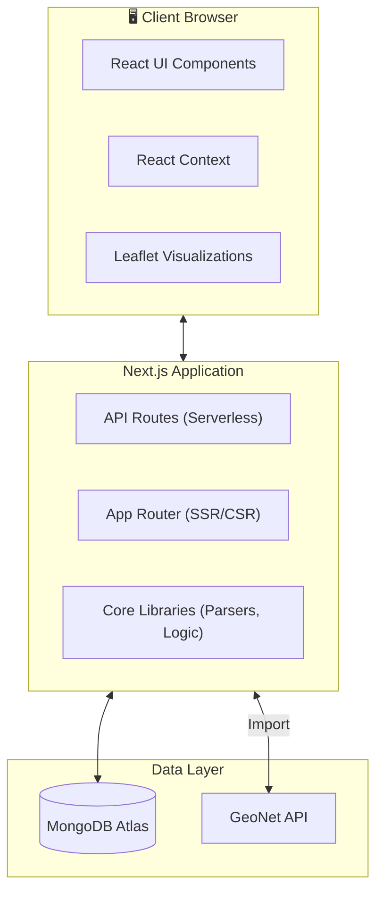
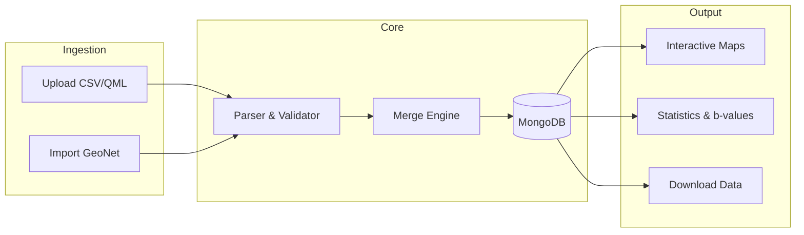

# Earthquake Catalogue Platform

📚 **Full Documentation:** [https://catalogofcatalogs.readthedocs.io/en/latest/](https://catalogofcatalogs.readthedocs.io/en/latest/)

A web application for managing, analyzing, and visualizing earthquake catalogue data. It supports multiple formats (CSV, QuakeML, GeoJSON), automated imports from GeoNet, flexible merging, and advanced seismological analysis.

## 🌟 Features

*   **Data Management**: Support for CSV, TXT, JSON, GeoJSON, and QuakeML 1.2 (BED).
*   **Automated Import**: Real-time integration with GeoNet FDSN Event Web Service.
*   **Merge Capabilities**: Five conflict-resolution strategies (Quality-Based, Source Priority, Average Values, Most Recent Solution, Most Complete Record) with configurable time/distance matching windows; magnitude is not a matching parameter, only an internal consistency check.
*   **Advanced Visualization**: Interactive maps with colour modes (depth, quality, azimuthal gap, source catalogue), on-demand uncertainty ellipses, focal mechanisms (beach balls), and station-coverage colouring — no marker clustering; every event is its own marker.
*   **Seismological Analysis**: Gutenberg-Richter b-values, completeness magnitude (Mc), cluster detection, and energy release analysis.
*   **Quality Assessment**: Automated grading (A+ to F) based on location uncertainty, station coverage, and solution quality; the quality score is stored on import and filterable by a numeric minimum.
*   **Export**: Download data in CSV, QuakeML, JSON, GeoJSON, or KML, with per-event provenance, a version stamp and a SHA-256 checksum.

## 🚀 Getting Started

### Prerequisites
*   Node.js 22.12+ (22 LTS) or 24 LTS
*   MongoDB 6.x or higher (Local or Atlas)

### Installation

1.  **Clone and Install**
    ```bash
    git clone https://github.com/KennyGraham1/catalogofcatalogs.git
    cd catalogofcatalogs
    npm install
    ```

2.  **Configure Environment**
    Copy `.env.example` to `.env` and configure your database URI and auth secret.
    ```bash
    cp .env.example .env
    ```

3.  **Initialize Database**
    ```bash
    npx tsx scripts/init-database.ts
    ```
    Rerun this command on existing deployments before enabling imports. It now requires
    unique event IDs and a partial unique `(catalogue_id, source_id)` index. If legacy
    duplicates or conflicting indexes prevent creation, setup fails: back up and repair
    those records/index definitions before retrying. Setup does not delete duplicate data.

    Credential login uses shared MongoDB counters in 15-minute windows: 10 failed
    attempts per account from one client, and 50 per client across accounts. Successful
    sign-ins are not counted. Failures from other clients never lock an account: above
    100 in a window they are logged, and only clients that have signed in to that
    account before (or reset its password) may keep trying. The application creates a
    TTL index on `auth_rate_limits` to expire old counters; if its database role cannot
    create indexes this is logged and sign-in still works.

    These limits identify clients by `X-Forwarded-For`, so run the app behind a reverse
    proxy that overwrites that header with the peer address and that clients cannot
    bypass: for Docker, `nginx/nginx.conf` via
    `APP_BIND_ADDRESS=127.0.0.1 docker-compose -f docker-compose.prod.yml --profile with-nginx up -d`.
    Set `TRUSTED_PROXY_HOPS` to the number of such proxies (default 1; see `.env.example`).

4.  **Run Development Server**
    ```bash
    npm run dev
    ```
    Visit [http://localhost:3000](http://localhost:3000).

## 🛠 Technology Stack

*   **Frontend**: Next.js 15 (App Router), TypeScript, Tailwind CSS, shadcn/ui, Leaflet, Apache ECharts 6.
*   **Backend**: Next.js API Routes, MongoDB, xml2js.
*   **Testing**: Jest, React Testing Library.

## 🏗️ Architecture


```mermaid
flowchart TD
    subgraph Client["🖥️ Client Browser"]
        UI["React UI Components"]
        State["React Context"]
        Maps["Leaflet Visualizations"]
    end
    
    subgraph App["Next.js Application"]
        API["API Routes (Serverless)"]
        Pages["App Router (SSR/CSR)"]
        Lib["Core Libraries (Parsers, Logic)"]
    end
    
    subgraph Data["Data Layer"]
        DB[(MongoDB Atlas)]
        GeoNet["GeoNet API"]
    end
    
    Client <--> App
    App <--> DB
    App <-- Import --> GeoNet
```

## 📚 Documentation

The complete documentation is hosted on **[Read the Docs](https://catalogofcatalogs.readthedocs.io/en/latest/)**.

*   **[User Guide](https://catalogofcatalogs.readthedocs.io/en/latest/user-guide/index.html)** - Comprehensive guides for all features.
*   **[API Reference](https://catalogofcatalogs.readthedocs.io/en/latest/api-reference/index.html)** - Endpoints for catalogues, events, and imports.
*   **[Architecture](https://catalogofcatalogs.readthedocs.io/en/latest/developer-guide/architecture.html)** - System design and component diagrams.
*   **[Database Schema](https://catalogofcatalogs.readthedocs.io/en/latest/developer-guide/database-schema.html)** - MongoDB collections and QuakeML mapping.

## 🔄 Platform Workflow


```mermaid
flowchart LR
    subgraph Ingestion
        User[Upload CSV/QML]
        Live[Import GeoNet]
    end
    
    subgraph Core
        Process[Parser & Validator]
        Merge[Merge Engine]
        Store[(MongoDB)]
    end
    
    subgraph Output
        View[Interactive Maps]
        Analyze[Statistics & b-values]
        Export[Download Data]
    end
    
    User --> Process
    Live --> Process
    Process --> Merge
    Merge --> Store
    Store --> View
    Store --> Analyze
    Store --> Export
```

## 📊 Project Status

**Status**: ✅ Production Ready

Key capabilities include:
*   ✅ Multi-format data parser (CSV, delimited text, QuakeML, GeoJSON)
*   ✅ GeoNet import service with duplicate detection
*   ✅ Catalogue merging engine
*   ✅ Interactive visualizations (Map, Charts, Focal Mechanisms)
*   ✅ MongoDB Atlas integration

## 👥 Authors

*   **Kenny Graham** - Earth Sciences NZ

## 📄 License

This project is licensed under the MIT License.

### Integrity and production browser checks

`npm run test:runtime` exercises the real authentication middleware. To check database
concurrency and required indexes, set `MONGODB_TEST_URI` to a disposable MongoDB server
and run `npm run test:database`; the script creates and deletes its own test database.

After `npm run build`, start the app with a test database and auth secret, install
Chromium with `npx playwright install chromium`, and run
`PRODUCTION_TEST_URL=http://127.0.0.1:3000 npm run test:browser`. This verifies matching
CSP nonces and interactive hydration on login and catalogue pages. CI runs these
checks and blocks on dependency advisories rated moderate or higher.
