# Earthquake Catalogue Platform

📚 **Full Documentation:** [https://catalogofcatalogs.readthedocs.io/en/latest/](https://catalogofcatalogs.readthedocs.io/en/latest/)

A web application for managing, analyzing, and visualizing earthquake catalogue data. It supports multiple formats (CSV, QuakeML, GeoJSON), automated imports from GeoNet, flexible merging, and advanced seismological analysis.

## 🌟 Features

*   **Data Management**: Support for CSV, TXT, JSON, GeoJSON, and QuakeML 1.2 (BED).
*   **Automated Import**: Real-time integration with GeoNet FDSN Event Web Service.
*   **Merge Capabilities**: Tools to merge catalogues with configurable matching rules (time, distance, magnitude).
*   **Advanced Visualization**: Interactive maps with clustering, uncertainty ellipses, focal mechanisms (beach balls), and station coverage.
*   **Seismological Analysis**: Gutenberg-Richter b-values, completeness magnitude (Mc), cluster detection, and energy release analysis.
*   **Quality Assessment**: Automated grading (A+ to F) based on location uncertainty, station coverage, and solution quality.
*   **Export**: Download data in CSV or QuakeML formats.

## 🚀 Getting Started

### Prerequisites
*   Node.js 18.x or higher
*   MongoDB 6.x or higher (Local or Atlas)

### Installation

1.  **Clone and Install**
    ```bash
    git clone https://github.com/KennyGraham1/catalogofcatalogs.git
    cd catalogofcatalogs
    npm install
    ```

2.  **Configure Environment**
    Copy `.env.example` to `.env` and configure your database URI and auth secret.
    ```bash
    cp .env.example .env
    ```

3.  **Initialize Database**
    ```bash
    npx tsx scripts/init-database.ts
    ```

4.  **Run Development Server**
    ```bash
    npm run dev
    ```
    Visit [http://localhost:3000](http://localhost:3000).

## 🛠 Technology Stack

*   **Frontend**: Next.js 13 (App Router), TypeScript, Tailwind CSS, shadcn/ui, Leaflet, Recharts.
*   **Backend**: Next.js API Routes, MongoDB, xml2js.
*   **Testing**: Jest, React Testing Library.

## 🏗️ Architecture

```mermaid
flowchart TD
    subgraph Client["🖥️ Client Browser"]
        UI["React UI Components"]
        State["React Context"]
        Maps["Leaflet Visualizations"]
    end
    
    subgraph App["Next.js Application"]
        API["API Routes (Serverless)"]
        Pages["App Router (SSR/CSR)"]
        Lib["Core Libraries (Parsers, Logic)"]
    end
    
    subgraph Data["Data Layer"]
        DB[(MongoDB Atlas)]
        GeoNet["GeoNet API"]
    end
    
    Client <--> App
    App <--> DB
    App <-- Import --> GeoNet
```



## 📚 Documentation

The complete documentation is hosted on **[Read the Docs](https://catalogofcatalogs.readthedocs.io/en/latest/)**.

*   **[User Guide](https://catalogofcatalogs.readthedocs.io/en/latest/user-guide/index.html)** - Comprehensive guides for all features.
*   **[API Reference](https://catalogofcatalogs.readthedocs.io/en/latest/api-reference/index.html)** - Endpoints for catalogues, events, and imports.
*   **[Architecture](https://catalogofcatalogs.readthedocs.io/en/latest/developer-guide/architecture.html)** - System design and component diagrams.
*   **[Database Schema](https://catalogofcatalogs.readthedocs.io/en/latest/developer-guide/database-schema.html)** - MongoDB collections and QuakeML mapping.

## 🔄 Platform Workflow


## 📊 Project Status

**Status**: ✅ Production Ready

Key capabilities include:
*   ✅ Multi-format data parser (CSV, delimited text, QuakeML, GeoJSON)
*   ✅ GeoNet import service with duplicate detection
*   ✅ Catalogue merging engine
*   ✅ Interactive visualizations (Map, Charts, Focal Mechanisms)
*   ✅ MongoDB Atlas integration

## 👥 Authors

*   **Kenny Graham** - Earth Sciences NZ

## 📄 License

This project is licensed under the MIT License.
